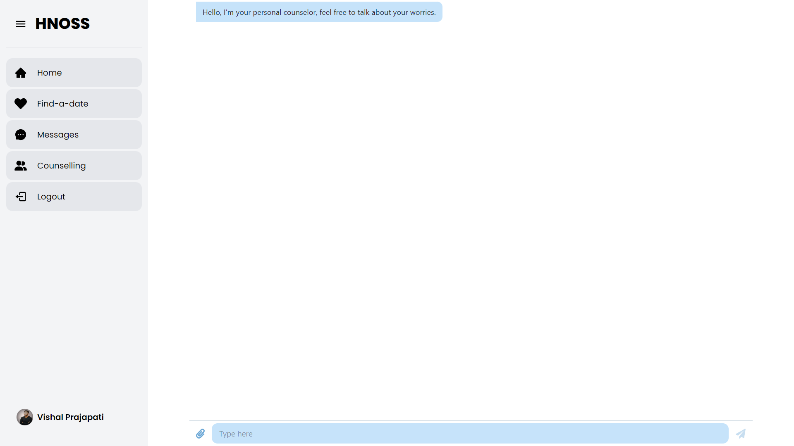
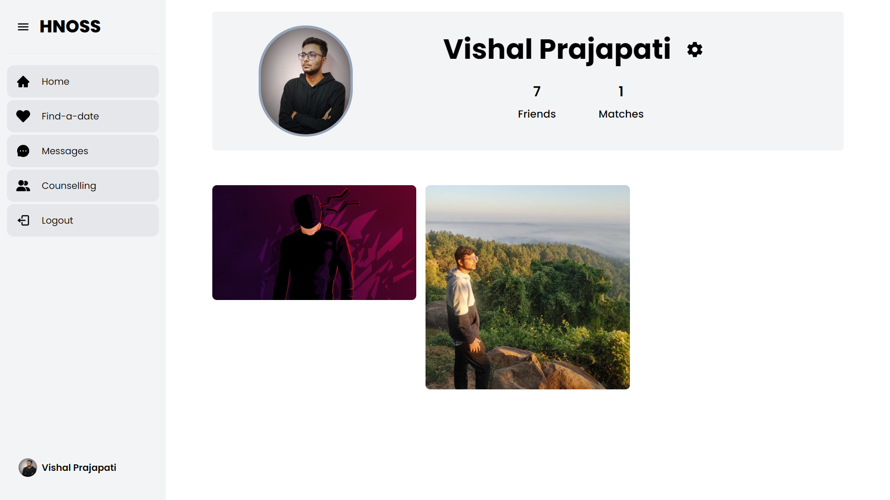

# **HNOSS: Find a perfect date**

Welcome to Hnoss, where social media and dating seamlessly merge to create a unique and engaging web application. Hnoss is not just another dating platform; it's a vibrant community where individuals can connect, interact, and explore meaningful relationships in a dynamic online environment. With its innovative fusion of social media features and dating functionalities, Hnoss provides a versatile platform to meet like-minded individuals and forge connections that matter.

<!--  -->

## Hnoss

---

## Web Application

- **Frontend**: Built with React and styled with Tailwind CSS for a sleek and modern user interface.
- **Backend**: Powered by Node.js and Express.js to handle server-side logic and API endpoints.
- **Database**: Utilizes MongoDB for storing user data and Firebase for real-time messaging features.

---

## Features

- **User Authentication and Authorization**: Seamlessly sign in or sign up to Hnoss using secure authentication methods. Safeguard your account with robust authorization protocols, ensuring a personalized and protected experience.

- **Post Sharing**: Share your experiences through images accompanied by descriptions. Engage with others' posts through likes, comments, and explore a diverse array of content shared by the community.

- **Chat**: Stay connected with friends through chat functionality. Instantly exchange messages, share updates, and maintain meaningful conversations with ease.

- **Date Discovery**: Explore potential matches with a simple swipe. Like profiles by swiping right, dislike them by swiping left, and discover mutual matches for potential connections.

- **Friend Management**: Expand your social circle by adding friends and connecting with others. Easily search and view friends' profiles, fostering a sense of community and connection within Hnoss.

- **Counseling Support**: Access a dedicated chatbot tailored for counseling purposes. Receive guidance, support, and resources through confidential conversations, providing assistance whenever needed.

---

## Getting Started

### Prerequisites

- Ensure you have Node.js installed on your machine.
- MongoDB should be installed and running locally or accessible via a MongoDB Atlas instance.

### Installation

1. **Clone the repository**:

    ```bash
    git clone https://github.com/vishal2537/hnoss.git
    ```

2. **Navigate to the project directory**:

    ```bash
    cd hnoss
    ```

3. **Install dependencies for both the server and client**:

    ```bash
    npm install
    ```

4. **Set up environment variables for the server**:
   - Create a `.env` file in the server directory.
   - Define environment variables such as `MONGODB_URL`, `JWT_SECRET_KEY`, and `PORT`.

5. **Set up environment variables for the client**:
    - Create a `.env` file in the client directory.
    - Define environment variables such as `VITE_APP_FIREBASE_API_KEY`, and `VITE_OPENAI_API_KEY`.

Now you're all set to explore Hnoss and start making meaningful connections!

---

### Preview
**Landing Page**: 

**Footer**: 

**User Authentication and Authorization**: 

**Home Page**: 

**Find a date**: 

**Message**: 

**Counselling Page**: 

**Profile Page**: 

**Friend List**: 

**Search Bar**: 

<!-- **Note**:  -->